# Reto 001 (Extensión) - Modelado Dinámico del Dominio en 4 Fases: "Farmear Aura"

**Estudiante:** Jose Luis de la Asunción  
**Asignatura:** Ingeniería del Software I (IDSW1)  
**Curso:** 2026-2027  
**Grado en Ingeniería Informática** — [Universidad Europea del Atlántico](https://www.uneatlantico.es)  

---

## 1. Introducción y Propósito

El presente documento constituye la resolución del **ejercicio de extensión del Reto 001** de **Ingeniería del Software I (IDSW1)**. Siguiendo el temario de la asignatura (en particular los documentos de referencia [*Modelo del dominio*](../../../idsw1/temario/contenidos/00004-MdD.md) y [*Diagramas*](../../../idsw1/temario/contenidos/ejemplos/diagramas/diagramas001.md)), se aborda el modelado del proceso y dinámica del dominio **"Farmear Aura"**.

Para comprender y especificar rigurosamente este fenómeno social, se desarrollan **4 fases incrementales**, y en **cada una de las 4 fases** se construyen los **4 tipos fundamentales de diagramas de comportamiento del dominio**:

1. **Diagrama de Actividad (DA):** *Qué se hace, en qué orden* (flujo de control y acciones).
2. **Diagrama de Estados (DE):** *En qué situación se encuentra la entidad, qué eventos provocan los cambios* (ciclo de vida y transiciones).
3. **Diagrama de Secuencia (DS):** *Quién hace qué, cuándo, con énfasis temporal* (intercambio ordenado de mensajes entre participantes).
4. **Diagrama de Colaboración (DC):** *Quién se comunica con quién, qué mensajes intercambian* (énfasis en las relaciones estructurales entre participantes).

---

## 2. Marco Metodológico y Perspectivas de Modelado

Tal como se recoge en `diagramas001.md`:
* **Actividad y Estados:** Son conceptualmente complementarios bajo flujos de control. El diagrama de actividades modela el flujo procedural de las acciones, mientras que el de estados modela el impacto de esos eventos en la condición interna de las entidades (`Aura`, `Persona`).
* **Secuencia y Colaboración:** Introducen a los **participantes** como una dimensión explícita (`Persona`, `Gesto`, `Audiencia`, `Aura`, `RedSocial`). El diagrama de secuencia enfatiza la línea temporal, mientras que el de colaboración enfatiza la red de comunicación estructural.

```
┌────────────────────────────────────────────────────────────────────────────────────────┐
│                      MATRIZ DE MODELADO: 4 FASES × 4 PERSPECTIVAS                      │
├──────────────┬───────────────────┬───────────────────┬───────────────────┬─────────────┤
│ Perspectiva  │ Fase 1: Base      │ Fase 2: Bifurcada │ Fase 3: Reintentos│ Fase 4:     │
│              │ (Flujo Ideal)     │ (Éxito / Fracaso) │ (Regla Tryhard)   │ Viralidad++ │
├──────────────┼───────────────────┼───────────────────┼───────────────────┼─────────────┤
│ Actividad    │ fase1-DA.puml     │ fase2-DA.puml     │ fase3-DA.puml     │ fase4-DA.puml│
│ Estados      │ fase1-DE.puml     │ fase2-DE.puml     │ fase3-DE.puml     │ fase4-DE.puml│
│ Secuencia    │ fase1-DS.puml     │ fase2-DS.puml     │ fase3-DS.puml     │ fase4-DS.puml│
│ Colaboración │ fase1-DC.puml     │ fase2-DC.puml     │ fase3-DC.puml     │ fase4-DC.puml│
└──────────────┴───────────────────┴───────────────────┴───────────────────┴─────────────┘
```

---

## 3. Fase 1: Flujo Base / Lineal (El Intento Ingenuo de Farmear Aura)

### 3.1. Narrativa del Dominio
En esta primera iteración se modela el escenario idealizado y lineal que surgió en el planteamiento inicial de la pizarra: una persona ejecuta un gesto en un entorno social, la audiencia presente lo atestigua, lo percibe favorablemente y se incrementa de forma directa el balance de aura del sujeto.

### 3.2. Diagramas de la Fase 1

#### A. Diagrama de Actividad (Fase 1)
Describe la secuencia lineal pura de acciones que conforman el intento básico de farmeo.

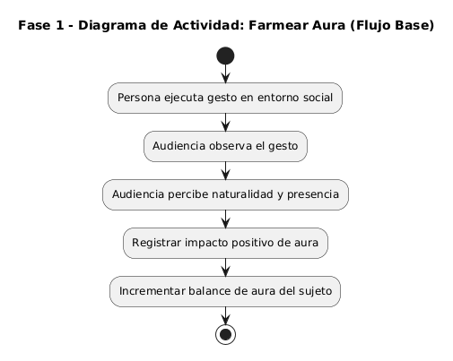  
> Código fuente: [`fase1-DA.puml`](./diagramas/fase1-DA.puml)

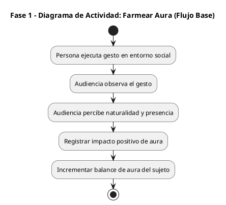
```plantuml
@startuml fase1-DA
title Fase 1 - Diagrama de Actividad: Farmear Aura (Flujo Base)

start
:Persona ejecuta gesto en entorno social;
:Audiencia observa el gesto;
:Audiencia percibe naturalidad y presencia;
:Registrar impacto positivo de aura;
:Incrementar balance de aura del sujeto;
stop

@enduml
```

#### B. Diagrama de Estados (Fase 1)
Refleja el ciclo de vida del sujeto/aura desde la tranquilidad hasta la adquisición de prestigio social.

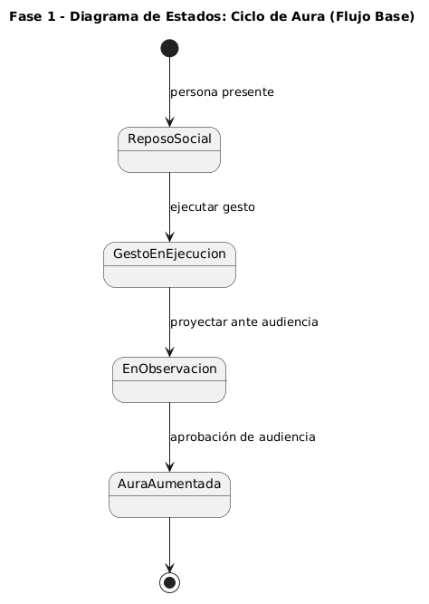  
> Código fuente: [`fase1-DE.puml`](./diagramas/fase1-DE.puml)

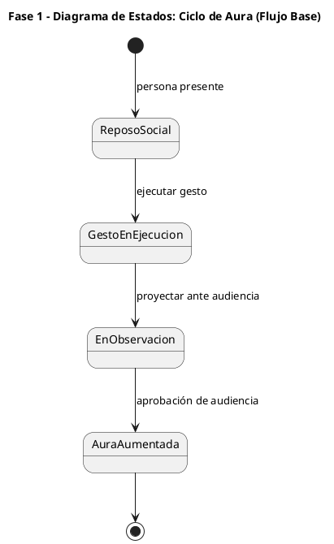
```plantuml
@startuml fase1-DE
title Fase 1 - Diagrama de Estados: Ciclo de Aura (Flujo Base)

[*] --> ReposoSocial : persona presente
ReposoSocial --> GestoEnEjecucion : ejecutar gesto
GestoEnEjecucion --> EnObservacion : proyectar ante audiencia
EnObservacion --> AuraAumentada : aprobación de audiencia
AuraAumentada --> [*]

@enduml
```

#### C. Diagrama de Secuencia (Fase 1)
Muestra los participantes involucrados (`Persona`, `Gesto`, `Audiencia`, `Aura`) y el orden temporal de los mensajes.

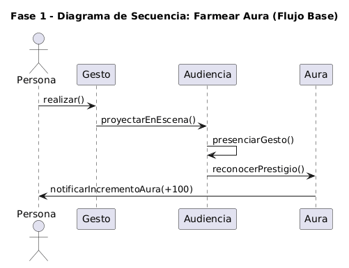  
> Código fuente: [`fase1-DS.puml`](./diagramas/fase1-DS.puml)

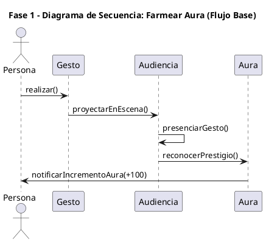
```plantuml
@startuml fase1-DS
title Fase 1 - Diagrama de Secuencia: Farmear Aura (Flujo Base)

actor Persona
participant "Gesto" as G
participant "Audiencia" as Aud
participant "Aura" as A

Persona -> G : realizar()
G -> Aud : proyectarEnEscena()
Aud -> Aud : presenciarGesto()
Aud -> A : reconocerPrestigio()
A -> Persona : notificarIncrementoAura(+100)

@enduml
```

#### D. Diagrama de Colaboración (Fase 1)
Representa los mismos estímulos que la secuencia pero sobre la red de conexiones estructurales de los objetos.

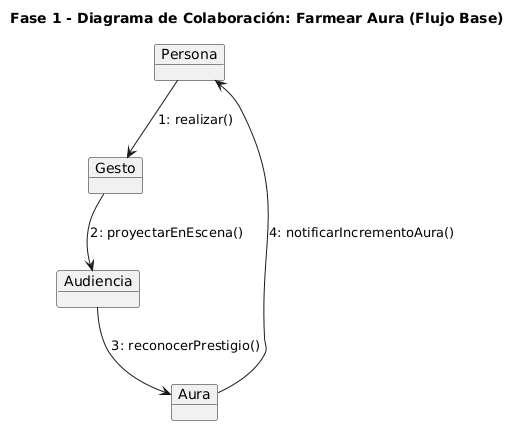  
> Código fuente: [`fase1-DC.puml`](./diagramas/fase1-DC.puml)

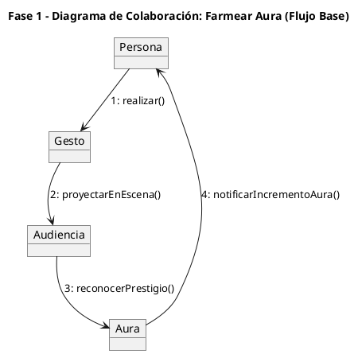
```plantuml
@startuml fase1-DC
title Fase 1 - Diagrama de Colaboración: Farmear Aura (Flujo Base)

object Persona
object Gesto
object Audiencia
object Aura

Persona --> Gesto : 1: realizar()
Gesto --> Audiencia : 2: proyectarEnEscena()
Audiencia --> Aura : 3: reconocerPrestigio()
Aura --> Persona : 4: notificarIncrementoAura()

@enduml
```

### 3.3. Análisis del Proceso en la Fase 1
* **Aportación:** Se formalizan los 4 participantes clave superando el bucle cerrado Persona-Gesto-Aura.
* **Limitación identificada:** Asume que todo gesto siempre tiene éxito. En la realidad de la interacción humana, un gesto torpe provoca rechazo o vergüenza ajena (*cringe*), ocasionando pérdida de aura. Esta necesidad motiva la Fase 2.

---

## 4. Fase 2: Bifurcación Semántica (Éxito vs Fracaso / Pérdida de Aura)

### 4.1. Narrativa del Dominio
El farmeo de aura conlleva un riesgo inherente. La `Audiencia` actúa como juez crítico: si el gesto denota soltura, templanza o ingenio, genera una **Ganancia de Aura** (+aura); si el gesto es torpe, fingido o fuera de lugar, genera una **Pérdida de Aura** (-aura) y vergüenza social.

### 4.2. Diagramas de la Fase 2

#### A. Diagrama de Actividad (Fase 2)
Introduce un punto de decisión formal condicionado al juicio de la audiencia.

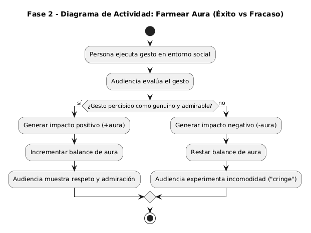  
> Código fuente: [`fase2-DA.puml`](./diagramas/fase2-DA.puml)

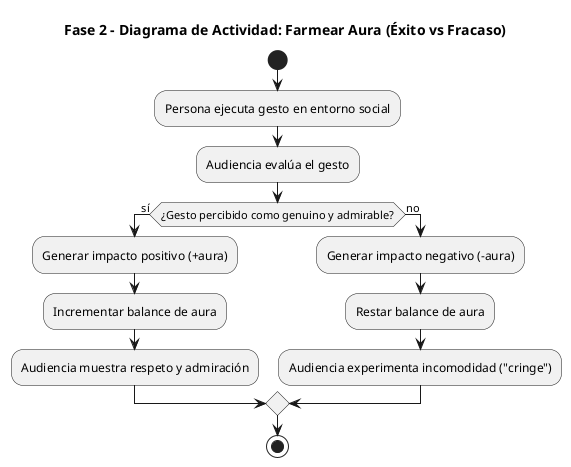
```plantuml
@startuml fase2-DA
title Fase 2 - Diagrama de Actividad: Farmear Aura (Éxito vs Fracaso)

start
:Persona ejecuta gesto en entorno social;
:Audiencia evalúa el gesto;
if (¿Gesto percibido como genuino y admirable?) then (sí)
  :Generar impacto positivo (+aura);
  :Incrementar balance de aura;
  :Audiencia muestra respeto y admiración;
else (no)
  :Generar impacto negativo (-aura);
  :Restar balance de aura;
  :Audiencia experimenta incomodidad ("cringe");
endif
stop

@enduml
```

#### B. Diagrama de Estados (Fase 2)
Distingue los dos estados finales mutuamente excluyentes resultantes de la evaluación: `AuraGanada` frente a `AuraPerdida`.

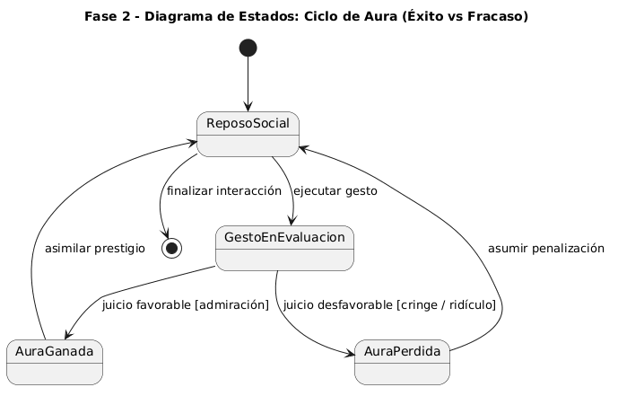  
> Código fuente: [`fase2-DE.puml`](./diagramas/fase2-DE.puml)

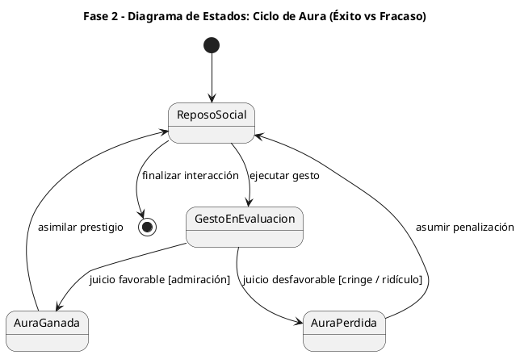
```plantuml
@startuml fase2-DE
title Fase 2 - Diagrama de Estados: Ciclo de Aura (Éxito vs Fracaso)

[*] --> ReposoSocial
ReposoSocial --> GestoEnEvaluacion : ejecutar gesto
GestoEnEvaluacion --> AuraGanada : juicio favorable [admiración]
GestoEnEvaluacion --> AuraPerdida : juicio desfavorable [cringe / ridículo]
AuraGanada --> ReposoSocial : asimilar prestigio
AuraPerdida --> ReposoSocial : asumir penalización
ReposoSocial --> [*] : finalizar interacción

@enduml
```

#### C. Diagrama de Secuencia (Fase 2)
Utiliza un bloque alternativo (`alt / else`) para modelar las dos trayectorias de interacción y la participación de `RegistroImpacto`.

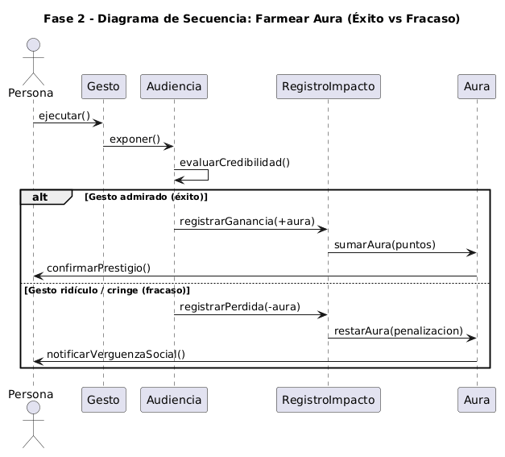  
> Código fuente: [`fase2-DS.puml`](./diagramas/fase2-DS.puml)

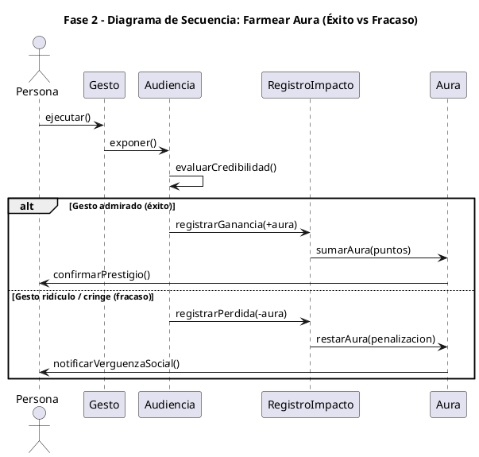
```plantuml
@startuml fase2-DS
title Fase 2 - Diagrama de Secuencia: Farmear Aura (Éxito vs Fracaso)

actor Persona
participant "Gesto" as G
participant "Audiencia" as Aud
participant "RegistroImpacto" as Reg
participant "Aura" as A

Persona -> G : ejecutar()
G -> Aud : exponer()
Aud -> Aud : evaluarCredibilidad()
alt Gesto admirado (éxito)
    Aud -> Reg : registrarGanancia(+aura)
    Reg -> A : sumarAura(puntos)
    A -> Persona : confirmarPrestigio()
else Gesto ridículo / cringe (fracaso)
    Aud -> Reg : registrarPerdida(-aura)
    Reg -> A : restarAura(penalizacion)
    A -> Persona : notificarVerguenzaSocial()
end

@enduml
```

#### D. Diagrama de Colaboración (Fase 2)
Incorpora mensajes condicionados con guardas (`[éxito]` y `[fracaso]`) entre las instancias.

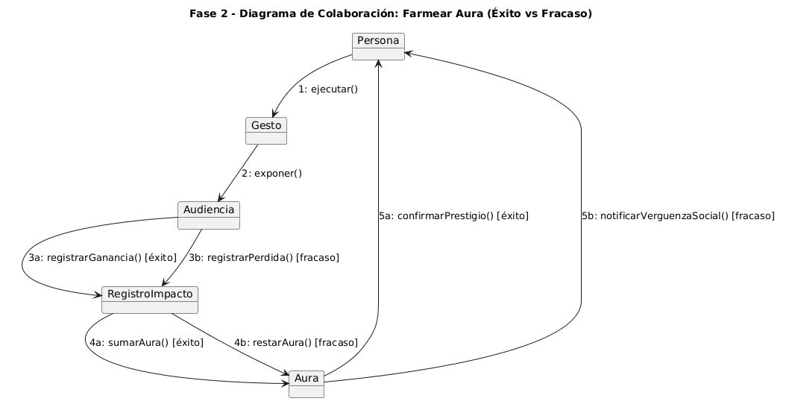  
> Código fuente: [`fase2-DC.puml`](./diagramas/fase2-DC.puml)

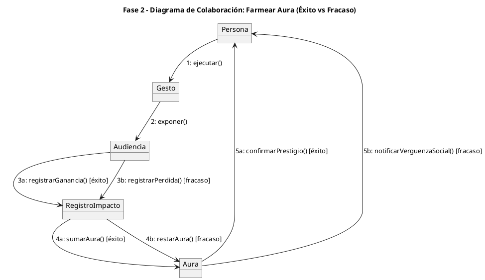
```plantuml
@startuml fase2-DC
title Fase 2 - Diagrama de Colaboración: Farmear Aura (Éxito vs Fracaso)

object Persona
object Gesto
object Audiencia
object RegistroImpacto
object Aura

Persona --> Gesto : 1: ejecutar()
Gesto --> Audiencia : 2: exponer()
Audiencia --> RegistroImpacto : 3a: registrarGanancia() [éxito]
Audiencia --> RegistroImpacto : 3b: registrarPerdida() [fracaso]
RegistroImpacto --> Aura : 4a: sumarAura() [éxito]
RegistroImpacto --> Aura : 4b: restarAura() [fracaso]
Aura --> Persona : 5a: confirmarPrestigio() [éxito]
Aura --> Persona : 5b: notificarVerguenzaSocial() [fracaso]

@enduml
```

### 4.3. Análisis del Proceso en la Fase 2
* **Aportación:** Se captura la dualidad real de ganancia y pérdida.
* **Limitación identificada:** En la interacción real, cuando una persona sufre un desliz inicial, rara vez se congela de inmediato: suele intentar un contra-gesto, una autoironía o una justificación para salvar el honor. Sin embargo, forzar demasiado la situación resulta en la temida penalización por **"tryhard"**. Esto motiva la Fase 3.

---

## 5. Fase 3: Reintentos de Recuperación y Penalización "Tryhard"

### 5.1. Narrativa del Dominio
Se añade la dinámica de **reintento y resiliencia social**:
1. Si el primer gesto no convence, el sujeto tiene hasta **2 intentos de recuperación** (p. ej., broma autocrítica o réplica ingeniosa).
2. Si el sujeto logra recomponerse dentro del límite, salva la dignidad y mitiga el daño.
3. Si supera el límite o persiste de manera desesperada y forzada, la audiencia activa la sanción por **"Tryhard"**, provocando una pérdida catastrófica y multiplicada de aura.

### 5.2. Diagramas de la Fase 3

#### A. Diagrama de Actividad (Fase 3)
Estructurado con bucles de reintento (`repeat / while`), control de contador de intentos y bifurcación entre recuperación y sanción severa.

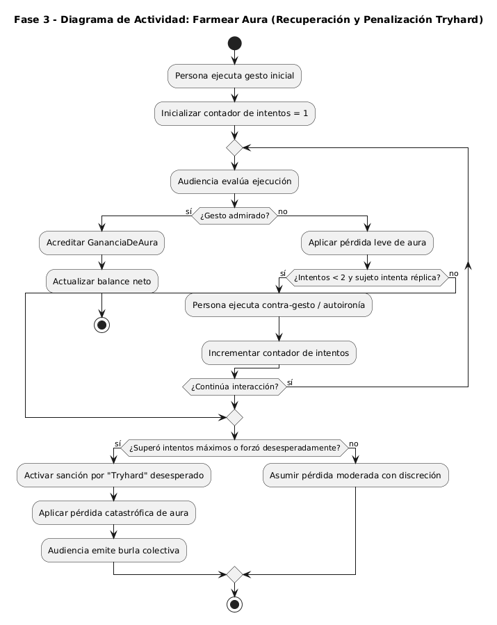  
> Código fuente: [`fase3-DA.puml`](./diagramas/fase3-DA.puml)

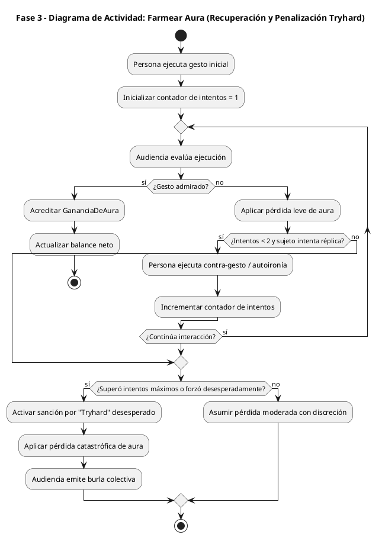
```plantuml
@startuml fase3-DA
title Fase 3 - Diagrama de Actividad: Farmear Aura (Recuperación y Penalización Tryhard)

start
:Persona ejecuta gesto inicial;
:Inicializar contador de intentos = 1;
repeat
  :Audiencia evalúa ejecución;
  if (¿Gesto admirado?) then (sí)
    :Acreditar GananciaDeAura;
    :Actualizar balance neto;
    stop
  else (no)
    :Aplicar pérdida leve de aura;
    if (¿Intentos < 2 y sujeto intenta réplica?) then (sí)
      :Persona ejecuta contra-gesto / autoironía;
      :Incrementar contador de intentos;
    else (no)
      break
    endif
  endif
repeat while (¿Continúa interacción?) is (sí)

if (¿Superó intentos máximos o forzó desesperadamente?) then (sí)
  :Activar sanción por "Tryhard" desesperado;
  :Aplicar pérdida catastrófica de aura;
  :Audiencia emite burla colectiva;
else (no)
  :Asumir pérdida moderada con discreción;
endif
stop

@enduml
```

#### B. Diagrama de Estados (Fase 3)
Muestra estados de transición intermedia como `EnRiesgo`, loops de reintento `[intentos < 2]` y el estado degradado `DegradadoTryhard`.

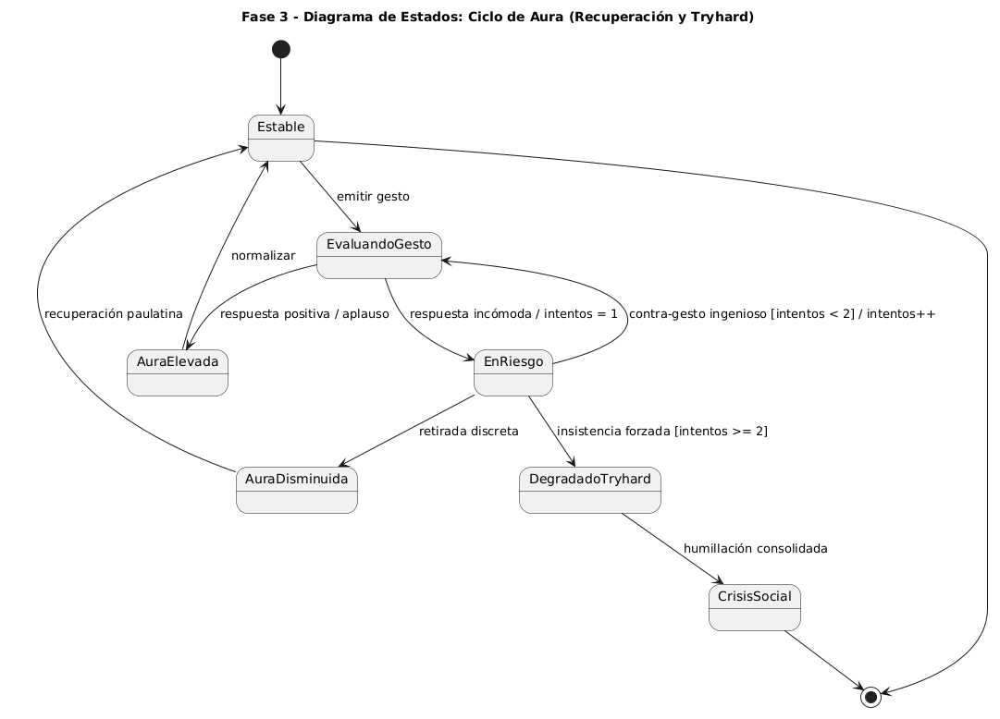  
> Código fuente: [`fase3-DE.puml`](./diagramas/fase3-DE.puml)

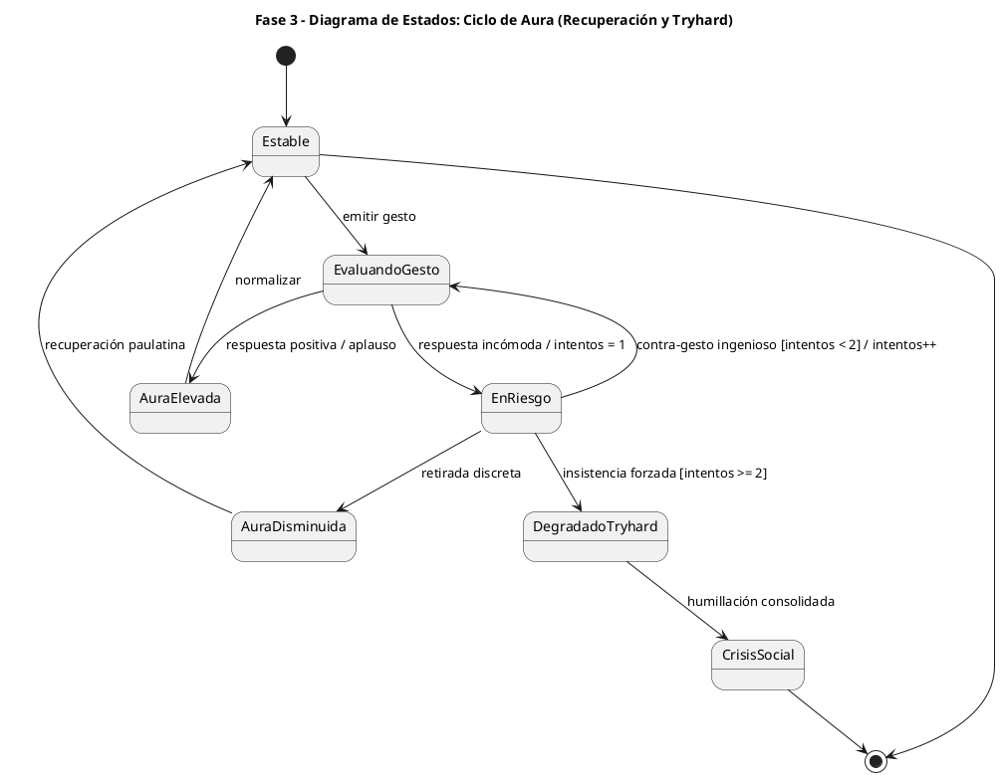
```plantuml
@startuml fase3-DE
title Fase 3 - Diagrama de Estados: Ciclo de Aura (Recuperación y Tryhard)

[*] --> Estable
Estable --> EvaluandoGesto : emitir gesto
EvaluandoGesto --> AuraElevada : respuesta positiva / aplauso
EvaluandoGesto --> EnRiesgo : respuesta incómoda / intentos = 1
EnRiesgo --> EvaluandoGesto : contra-gesto ingenioso [intentos < 2] / intentos++
EnRiesgo --> DegradadoTryhard : insistencia forzada [intentos >= 2]
EnRiesgo --> AuraDisminuida : retirada discreta
AuraElevada --> Estable : normalizar
DegradadoTryhard --> CrisisSocial : humillación consolidada
AuraDisminuida --> Estable : recuperación paulatina
CrisisSocial --> [*]
Estable --> [*]

@enduml
```

#### C. Diagrama de Secuencia (Fase 3)
Combina bucles temporales (`loop`) con ramas alternativas condicionales (`alt / else`).

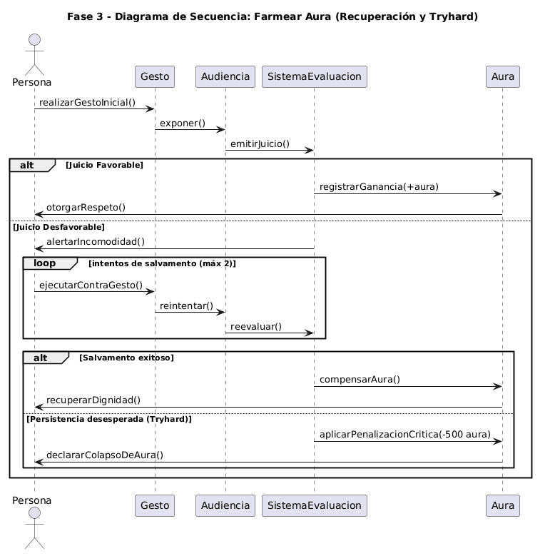  
> Código fuente: [`fase3-DS.puml`](./diagramas/fase3-DS.puml)

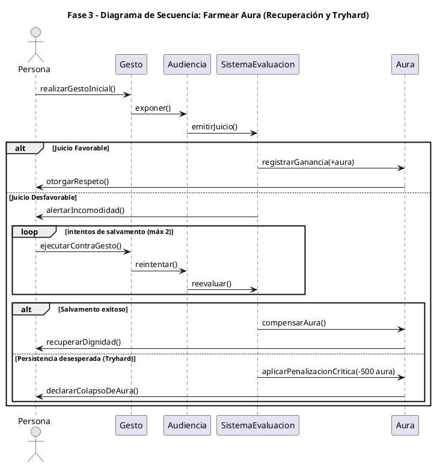
```plantuml
@startuml fase3-DS
title Fase 3 - Diagrama de Secuencia: Farmear Aura (Recuperación y Tryhard)

actor Persona
participant "Gesto" as G
participant "Audiencia" as Aud
participant "SistemaEvaluacion" as SE
participant "Aura" as A

Persona -> G : realizarGestoInicial()
G -> Aud : exponer()
Aud -> SE : emitirJuicio()
alt Juicio Favorable
    SE -> A : registrarGanancia(+aura)
    A -> Persona : otorgarRespeto()
else Juicio Desfavorable
    SE -> Persona : alertarIncomodidad()
    loop intentos de salvamento (máx 2)
        Persona -> G : ejecutarContraGesto()
        G -> Aud : reintentar()
        Aud -> SE : reevaluar()
    end
    alt Salvamento exitoso
        SE -> A : compensarAura()
        A -> Persona : recuperarDignidad()
    else Persistencia desesperada (Tryhard)
        SE -> A : aplicarPenalizacionCritica(-500 aura)
        A -> Persona : declararColapsoDeAura()
    end
end

@enduml
```

#### D. Diagrama de Colaboración (Fase 3)
Ilustra el intercambio numerado de mensajes con reintentos y penalizaciones sobre la estructura de objetos.

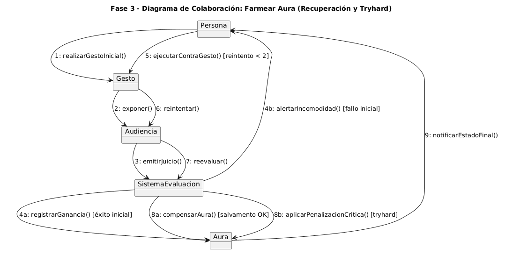  
> Código fuente: [`fase3-DC.puml`](./diagramas/fase3-DC.puml)

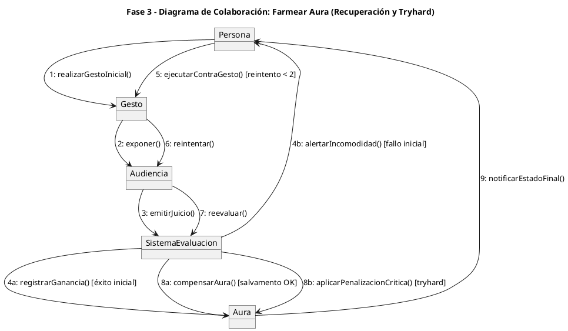
```plantuml
@startuml fase3-DC
title Fase 3 - Diagrama de Colaboración: Farmear Aura (Recuperación y Tryhard)

object Persona
object Gesto
object Audiencia
object SistemaEvaluacion
object Aura

Persona --> Gesto : 1: realizarGestoInicial()
Gesto --> Audiencia : 2: exponer()
Audiencia --> SistemaEvaluacion : 3: emitirJuicio()
SistemaEvaluacion --> Aura : 4a: registrarGanancia() [éxito inicial]
SistemaEvaluacion --> Persona : 4b: alertarIncomodidad() [fallo inicial]
Persona --> Gesto : 5: ejecutarContraGesto() [reintento < 2]
Gesto --> Audiencia : 6: reintentar()
Audiencia --> SistemaEvaluacion : 7: reevaluar()
SistemaEvaluacion --> Aura : 8a: compensarAura() [salvamento OK]
SistemaEvaluacion --> Aura : 8b: aplicarPenalizacionCritica() [tryhard]
Aura --> Persona : 9: notificarEstadoFinal()

@enduml
```

### 5.3. Análisis del Proceso en la Fase 3
* **Aportación:** Se resuelve la dinámica de resistencia y penalización por insistencia torpe.
* **Limitación identificada:** En la era digital, el farmeo de aura no se limita a la audiencia presencial: los teléfonos móviles graban las escenas y las suben a redes sociales. La **audiencia virtual** introduce un factor multiplicador masivo y la regla de **asimetría del daño reputacional**. Esto conduce a la Fase 4.

---

## 6. Fase 4: Modelo Maduro (Amplificación Viral, Asimetría y Reputación Consolidada)

### 6.1. Narrativa del Dominio
En la fase final y más completa del dominio:
1. **Concurrencia de Audiencias:** El gesto es presenciado simultáneamente por la `AudienciaPresencial` y retransmitido a través de `RedSocial` a una `AudienciaVirtual` masiva.
2. **Regla de Asimetría Reputacional:** Ganar aura requiere acumular éxitos virales de forma constante, pero un único ridículo viralizado aplica un multiplicador de daño desproporcionado (daño x5), destruyendo el balance neto acumulado.
3. **Consolidación de Estados de Reputación:** Se formalizan los estados de reputación permanente: `Neutral`, `EnAlza`, `AuraLegendaria`, `CringeViral` y `CanceladoSocial`.

### 6.2. Diagramas de la Fase 4

#### A. Diagrama de Actividad (Fase 4)
Introduce concurrencia con ramas paralelas (`fork / join`), cálculo de multiplicador viral y consolidación en el historial.

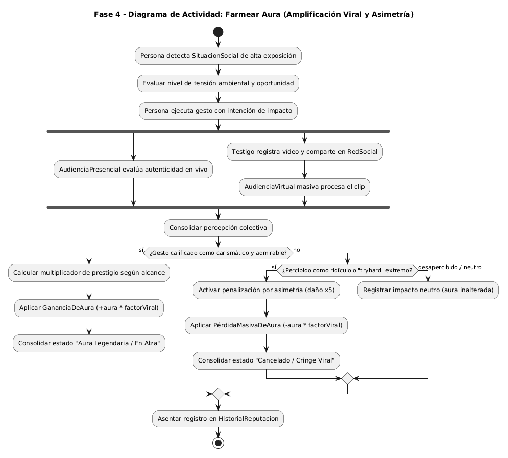  
> Código fuente: [`fase4-DA.puml`](./diagramas/fase4-DA.puml)

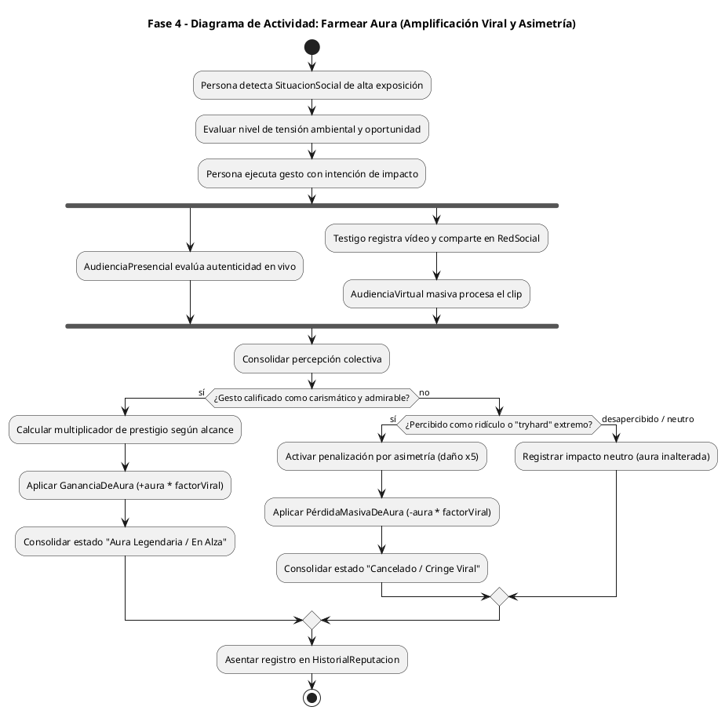
```plantuml
@startuml fase4-DA
title Fase 4 - Diagrama de Actividad: Farmear Aura (Amplificación Viral y Asimetría)

start
:Persona detecta SituacionSocial de alta exposición;
:Evaluar nivel de tensión ambiental y oportunidad;
:Persona ejecuta gesto con intención de impacto;
fork
  :AudienciaPresencial evalúa autenticidad en vivo;
fork again
  :Testigo registra vídeo y comparte en RedSocial;
  :AudienciaVirtual masiva procesa el clip;
end fork
:Consolidar percepción colectiva;
if (¿Gesto calificado como carismático y admirable?) then (sí)
  :Calcular multiplicador de prestigio según alcance;
  :Aplicar GananciaDeAura (+aura * factorViral);
  :Consolidar estado "Aura Legendaria / En Alza";
else (no)
  if (¿Percibido como ridículo o "tryhard" extremo?) then (sí)
    :Activar penalización por asimetría (daño x5);
    :Aplicar PérdidaMasivaDeAura (-aura * factorViral);
    :Consolidar estado "Cancelado / Cringe Viral";
  else (desapercibido / neutro)
    :Registrar impacto neutro (aura inalterada);
  endif
endif
:Asentar registro en HistorialReputacion;
stop

@enduml
```

#### B. Diagrama de Estados (Fase 4)
Máquina de estados completa con estado compuesto `Expuesto`, subestados de reputación y transiciones asimétricas.

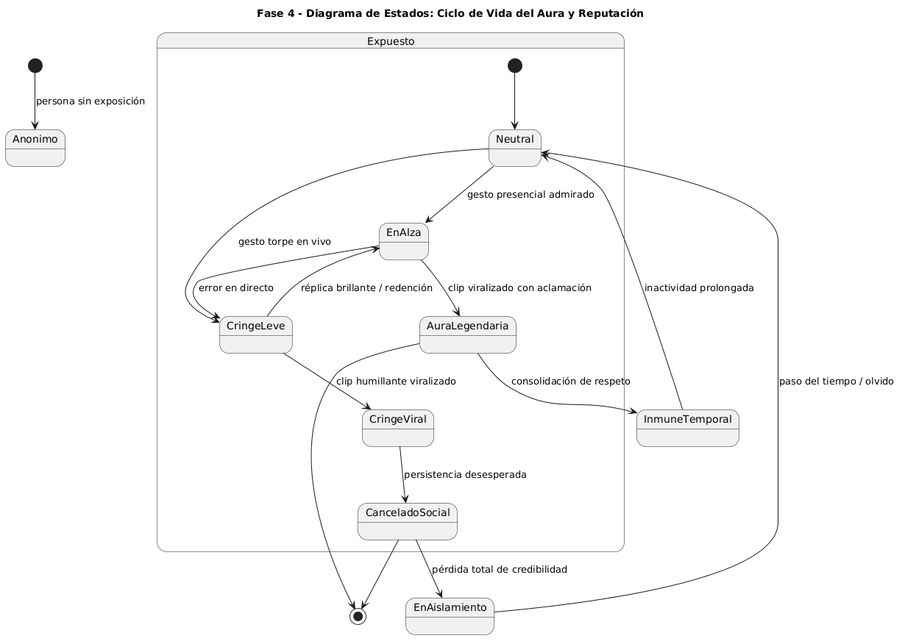  
> Código fuente: [`fase4-DE.puml`](./diagramas/fase4-DE.puml)

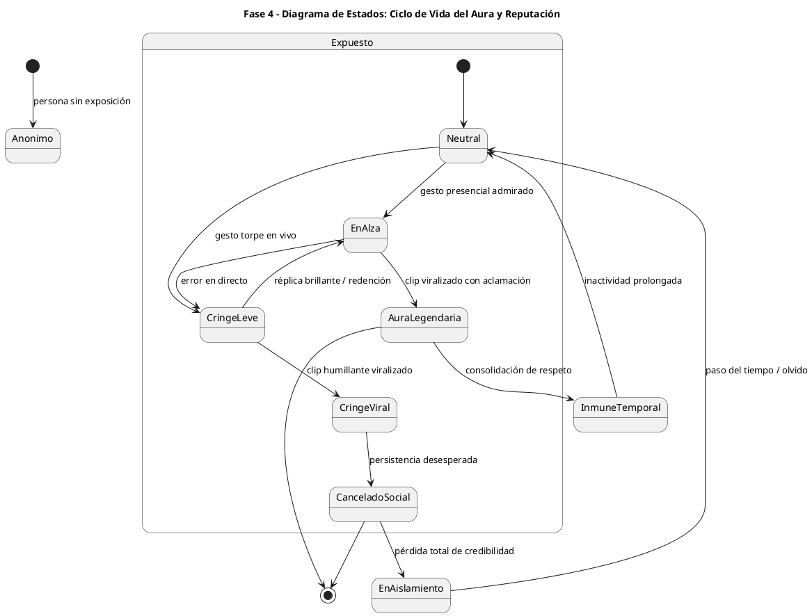
```plantuml
@startuml fase4-DE
title Fase 4 - Diagrama de Estados: Ciclo de Vida del Aura y Reputación

[*] --> Anonimo : persona sin exposición

state Expuesto {
  [*] --> Neutral
  Neutral --> EnAlza : gesto presencial admirado
  Neutral --> CringeLeve : gesto torpe en vivo
  
  EnAlza --> AuraLegendaria : clip viralizado con aclamación
  EnAlza --> CringeLeve : error en directo
  
  CringeLeve --> EnAlza : réplica brillante / redención
  CringeLeve --> CringeViral : clip humillante viralizado
  CringeViral --> CanceladoSocial : persistencia desesperada
}

AuraLegendaria --> InmuneTemporal : consolidación de respeto
CanceladoSocial --> EnAislamiento : pérdida total de credibilidad
EnAislamiento --> Neutral : paso del tiempo / olvido
InmuneTemporal --> Neutral : inactividad prolongada

CanceladoSocial --> [*]
AuraLegendaria --> [*]

@enduml
```

#### C. Diagrama de Secuencia (Fase 4)
Incorpora procesamiento concurrente (`par`), múltiples participantes de escala (`AudienciaPresencial`, `RedSocial`, `AudienciaVirtual`, `GestorReputacion`) y asimetría de resultados.

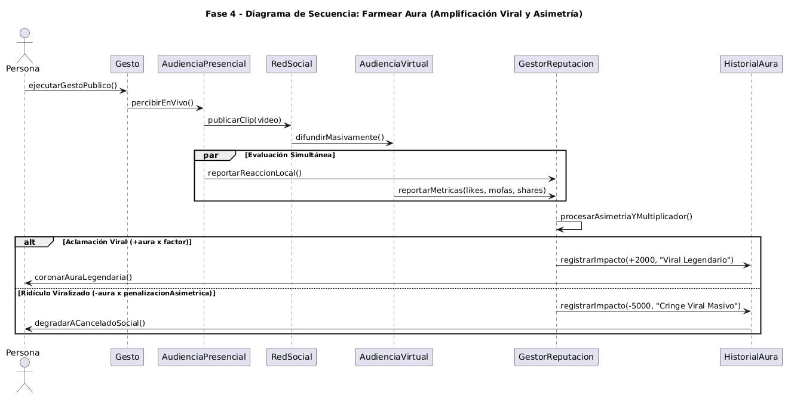  
> Código fuente: [`fase4-DS.puml`](./diagramas/fase4-DS.puml)

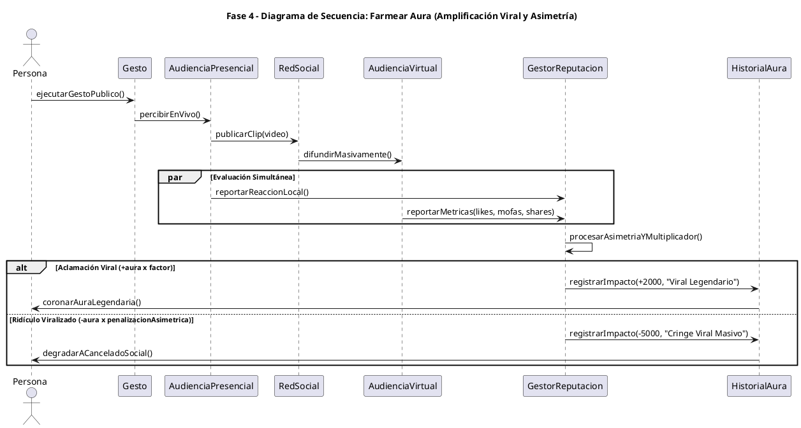
```plantuml
@startuml fase4-DS
title Fase 4 - Diagrama de Secuencia: Farmear Aura (Amplificación Viral y Asimetría)

actor Persona
participant "Gesto" as G
participant "AudienciaPresencial" as AP
participant "RedSocial" as RS
participant "AudienciaVirtual" as AV
participant "GestorReputacion" as GR
participant "HistorialAura" as HA

Persona -> G : ejecutarGestoPublico()
G -> AP : percibirEnVivo()
AP -> RS : publicarClip(video)
RS -> AV : difundirMasivamente()
par Evaluación Simultánea
    AP -> GR : reportarReaccionLocal()
    AV -> GR : reportarMetricas(likes, mofas, shares)
end
GR -> GR : procesarAsimetriaYMultiplicador()
alt Aclamación Viral (+aura x factor)
    GR -> HA : registrarImpacto(+2000, "Viral Legendario")
    HA -> Persona : coronarAuraLegendaria()
else Ridículo Viralizado (-aura x penalizacionAsimetrica)
    GR -> HA : registrarImpacto(-5000, "Cringe Viral Masivo")
    HA -> Persona : degradarACanceladoSocial()
end

@enduml
```

#### D. Diagrama de Colaboración (Fase 4)
Representa la topología completa de comunicaciones distribuidas del ecosistema digital.

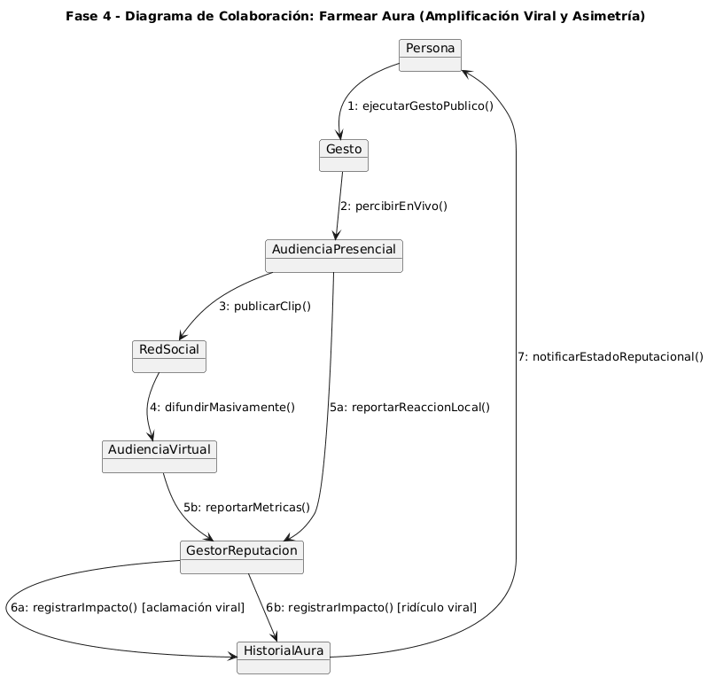  
> Código fuente: [`fase4-DC.puml`](./diagramas/fase4-DC.puml)

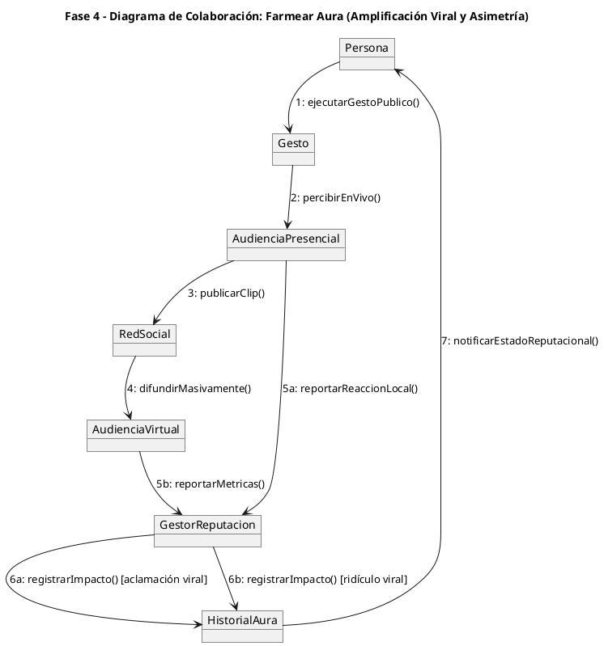
```plantuml
@startuml fase4-DC
title Fase 4 - Diagrama de Colaboración: Farmear Aura (Amplificación Viral y Asimetría)

object Persona
object Gesto
object AudienciaPresencial
object RedSocial
object AudienciaVirtual
object GestorReputacion
object HistorialAura

Persona --> Gesto : 1: ejecutarGestoPublico()
Gesto --> AudienciaPresencial : 2: percibirEnVivo()
AudienciaPresencial --> RedSocial : 3: publicarClip()
RedSocial --> AudienciaVirtual : 4: difundirMasivamente()
AudienciaPresencial --> GestorReputacion : 5a: reportarReaccionLocal()
AudienciaVirtual --> GestorReputacion : 5b: reportarMetricas()
GestorReputacion --> HistorialAura : 6a: registrarImpacto() [aclamación viral]
GestorReputacion --> HistorialAura : 6b: registrarImpacto() [ridículo viral]
HistorialAura --> Persona : 7: notificarEstadoReputacional()

@enduml
```

---

## 7. Comparativa de Complejidad entre Diagramas (según `diagramas001.md`)

Siguiendo el análisis del temario en [`diagramas001.md`](../../../idsw1/temario/contenidos/ejemplos/diagramas/diagramas001.md#comparación-de-complejidad), se contrastan las fortalezas y debilidades de cada tipo de diagrama a medida que evolucionó el dominio de "Farmear Aura":

| Criterio | Diagrama de Actividad | Diagrama de Estados | Diagrama de Secuencia | Diagrama de Colaboración |
|---|:---:|:---:|:---:|:---:|
| **Enfoque central** | Flujo procedural y orden de pasos | Ciclo de vida y condiciones del sujeto | Orden temporal e interacción entre partes | Conexiones estructurales e intercambio de mensajes |
| **Escalabilidad al crecer** | Pierde legibilidad al añadir bucles y fork/join | Mantiene alta claridad visual mediante subestados | Tiende a volverse denso con bloques `alt` y `par` | Requiere renumeración de mensajes y pierde secuencia temporal clara |
| **Manejo de reintentos** | Natural mediante `repeat/while` | Excelente mediante transiciones cíclicas y guardas | Requiere bloques `loop` que sobrecargan la línea de vida | Difícil de expresar sin confusión en la numeración |
| **Manejo de concurrencia** | Excelente mediante barras `fork / join` | Requiere subestados concurrentes ortogonales | Muy bueno mediante bloques `par` | Difícil de distinguir temporalmente |
| **Trazabilidad de negocio** | Clara en flujos principales, compleja en excepciones | Óptima para auditoría del estado del sujeto | Óptima para trazar responsabilidades individuales | Buena para ver el acoplamiento entre entidades |

---

## 8. Conclusiones y Autoevaluación

1. **Cumplimiento del temario:** Se han aplicado de manera estricta los principios de IDSW1, evitando antipatrones técnicos (sin tipos de datos de programación, sin visibilidad de métodos orientados a objetos, sin confusión con bases de datos).
2. **Proceso evolutivo comprobable:** El paso de la Fase 1 a la Fase 4 evidencia un crecimiento sostenido en madurez conceptual, desde la ilusión del éxito garantizado hasta la complejidad de las redes sociales, la asimetría del daño social y la regla de penalización por desesperación (*tryhard*).
3. **Consistencia multi-perspectiva:** Los 16 diagramas guardan total coherencia conceptual entre sí: lo que es una acción en actividades es un evento disparador en estados, un mensaje en secuencia y una interacción en colaboración.
